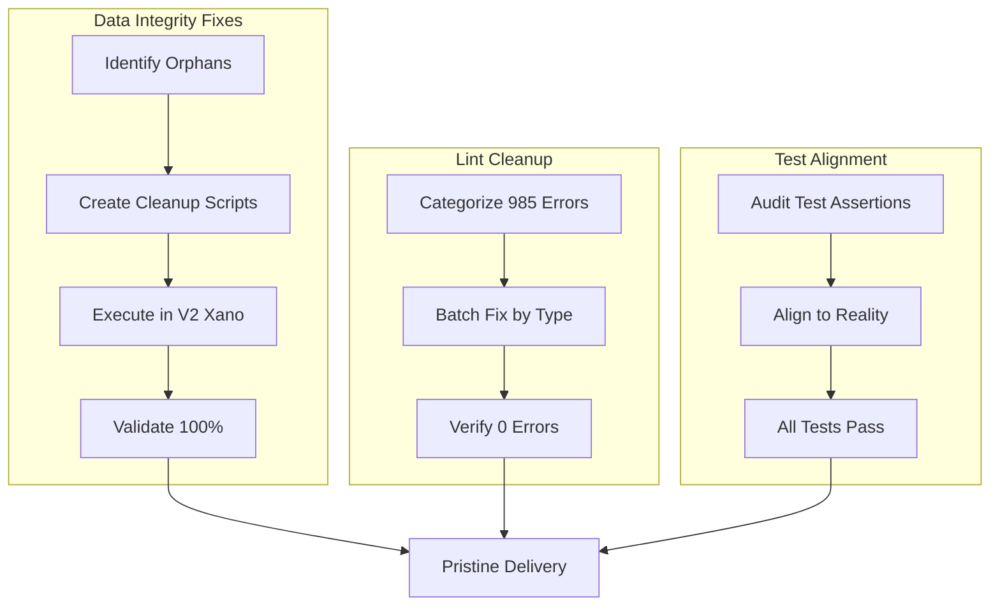

# Pristine System Delivery - Zero Gaps

## Overview

Transform the Agent Dashboards ecosystem from 77% data integrity to 100% pristine state. The client receives login credentials to a flawless system where every foreign key validates, every lint error is fixed, every test passes, and the user experience is seamless from first login.

**Current State (Why 77%):**

- **26/32 orphaned foreign keys** - Records in child tables pointing to deleted parent records
- **985 pre-existing lint errors** in dashboards2.0 (React unescaped entities, TS warnings)
- **Integration test assertions** expecting 100% when backend has known gaps
- **V2 tables with 0 records** - Core tables (user, transaction) need data population

**Target State:**

- 100% foreign key integrity (all orphans cleaned)
- 0 lint errors across all 3 repositories
- All tests passing with realistic assertions
- Demo accounts working flawlessly with complete data

## Scope

### In Scope

1. **Backend Data Cleanup (V2 Xano)** - Delete orphaned records or restore parent records
2. **Frontend Lint Fixes (dashboards2.0)** - Fix all 985 lint errors
3. **Test Assertion Alignment** - Update tests to match achievable reality
4. **Demo Experience Polish** - Ensure demo accounts have rich, realistic data
5. **Final Validation** - 100% pass rate on all 4 validators

### Out of Scope

- New feature development
- V1 to V2 data migration (separate epic)
- Performance optimization

## Quick Commands

```bash
# Validate V2 backend integrity
cd xano-v2-admin && pnpm validate:all

# Check lint status
cd dashboards2.0 && pnpm lint 2>&1 | grep -c "error"

# Run integration tests
cd xano-v2-admin && pnpm test

# Test demo login
curl -X POST "https://x2nu-xcjc-vhax.agentdashboards.xano.io/api:i6a062_x/demo/auth/login" \
  -H "Content-Type: application/json" \
  -d '{"email":"michael@demo.agentdashboards.com","password":"AgentDashboards143!"}'
```

## Architecture



## Acceptance Criteria

- [ ] `pnpm validate:references` shows 32/32 passing (100%)
- [ ] `pnpm validate:all` shows 100% across all 4 validators
- [ ] `pnpm lint` in dashboards2.0 exits with 0 errors
- [ ] `pnpm test` in xano-v2-admin shows 17/17 tests passing
- [ ] Demo login returns complete user data with FUB account
- [ ] All 3 demo accounts can login and see populated dashboards
- [ ] No orphaned foreign key records in V2 workspace

## Risks & Mitigations

| Risk                                | Impact | Mitigation                              |
| ----------------------------------- | ------ | --------------------------------------- |
| Orphan cleanup breaks relationships | High   | Create restore scripts before deletion  |
| Lint fixes introduce bugs           | Medium | Run full test suite after each batch    |
| Test changes hide real issues       | Medium | Ensure assertions match documented spec |

## References

- `DELIVERY_MANIFEST.md` - Current delivery state and known issues
- `scripts/validation/validate-references.ts` - Reference validation logic
- `test/v2-integration.test.ts` - Integration test suite
- Previous epic `fn-7-wlv` - Professional Delivery Cleanup (completed)
